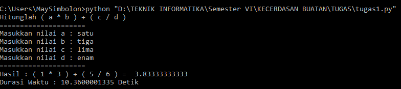

# KECERDASAN BUATAN
## Latar Belakang

* Pengertian kecerdasan buatan
* Efisien dan efektik dalam kecerdasan buatan

## Isi

## Kecerdasan Buatan
* Cerdas : dapat kita artikan cepat dan tepat.( Defendant ∞T saat berjalannya waktu atau lebih pada waktu proses berlangsung )
* Tepat : Lebih pada hasil yang ditargetkan atau tujuan yang diinginkan.

## Efisien dan Efektif

* Efisisen
Misalkan pada sebuah sepeda motor yang menggunakan BBM, kita simak sebuah pernyaaan, BBM saya efisien. Nah, pernyataan itu brarti BBM nya irit mengacu pada hal biaya (cost), dari cost tersebut dapat kita lihat dari waktu dan materi.  Maka dapat diartikan bahwa efisien itu cepat.

* Efektif
Misalkan ada pernyataan “ Baygon Efektif dalam membunuh nyamuk”. Efektif disini yaitu ampuh dalam membunuh nyamuk, berarti baygon dapat memenuhi target yaitu membunuh nyamuk. Maka dapat diartikan bahwa efektif berarti tepat sasaran.

Contoh lain :
7+5 = 12 -> Tepat Efektif
7+5 = 12 -> Tepat efektif (dalam waktu 3 detik) Efisien
CEPAT + TEPAT -> CERDAS

Jadi dapat dilihat dari penjelasan diatas yaitu antara efektif dan efisien yaitu Cerdas dan cerdas itu dapat dilatih.

Buatan = Artisial
Kecerdasan Buatan adlaah ilmu untuk merekaya sebuah mesin agar lebih cepat dan tepat.
Cth Program :

  

## Kesimpulan 

Kesimpulanny adalah, Kecerdasan Buatan sangat kita butuhkan dalam kehidupan yang modern saat ini, kita dapat menciptakan hal yang baru yang lebih cepat dan tepat sesuai target yang kita inginkan.

## Saran

Agar lebih mencari refrensi untuk menunjangn matakuliah kecerdasan buatan. ^^ 

* Nama : Tentri May Simbolon
* NPM : 1144027
* Kelas : D4 Teknik Informatika 3C
* Kampus : Politeknik Pos Indonesia