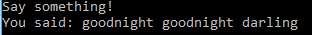

# Pengelolaan Bahasa Alami

## Latar Belakang Masalah
1. Pengelolaan Bahasa Alami
2. Bidang Pengetahuan Dalam Natural Language
3. Speech Recognition

## Isi
1. Pengelolaan Bahasa Alami

Pengelolaan Bahasa Alami adalah suatu proses pembuatan model komputasi sehingga terjadi suatu interaksi manusia dengan computer dengan menggunakan Bahasa keseharian kita 
(manusia). 

2. Bidang Pengetahuan Dalam Natural Language

* Fonetik dan Fonologi

Berkaitan dengan suara yang menghasilkan kata yang dapat dikenali. 
Cth: Siri

* Morfologi 

Pembentukan kata dari kata dasar. Pengetahuan tentang kata yang bentuknya dimanfaatkan untuk membedakan saku kata dengan kata yang lainnya.  
Cth :  Menyanyi ( me -nyanyi ) 
	  Lari-lari ( banyak yang lari )

* Sintaksis

Pemahaman tentang urutan kata dalam sebuah kalimat, dalam pembentukan kalimat dan hubungan antar kata dapat membuat suatu perubahan sebuah kalian yang bentuknya menjadi bentu yang sistematis. 
Contoh : 
IBU PERGI KE PASAR 
 S       P	     K 
IBU SEDANG MEMBACA BUKU 
S        P           O

* Semantik

Pembuatan bentuk struktur sintaksis dari arta kata sesungguhnya ( paling dasar ). Semantik mempelajari kata demi kata, kata-kata yang alig dasar dan membentuk suatu arti kalimat yang utuh. 
Cth : Kutu Buku

* Pragmatik

Pengetahuan tentang konteks tergantung pada tujuan dan situasi pembetukan kaliamat.

* Discourse Knowlodge

Pengetahuan tentang melihat kemabli apakah suatu kaliam yang sudah dibaca atau sudah dikenali sebelumnya akan sama artinya dengan kalimat selanjutnya.

* Word Knowledge

Pengetahuan tentang arti umum maupun arti khusu sebuah kata pada sebuah konteks.

3. Speech Recognition

SpeechRecognition merupakan library python untuk melakukan pengenalan suara, dengan dukungan beberapa mesin dan API, online dan offline. Dibawah ini akan dijelaskan bagaimana cara menginstall dan apa saja yang dibutuhkan sebelum menginstall SpeechRecognition pada sistem operasi Windows. 

Pertama, install terlebih dahulu pyaudio yang digunakan untuk menginput micropone. 
~~~
Pip install pyaudio
~~~
Selanjutnya install PocketSphinx untuk menggunakan Sphinx recognizer.
~~~
Pip install wheel
~~~
Lalu install Google API Client Library for Python untuk menggunakan Google Cloud Speech API.
~~~
Pip install geogle-api-python-client
~~~
Terakhir install SpeechRecognition.
~~~
Pip install speechRecognition
~~~
Selesai. 
Dibawah ini juga terdapat contoh hasil program mengubah suara ke teks menggunakan library SpeechRecognition. 
Hasil Implementasi

## Kesimpulan
Pengelolaan Bahasa Alami adalah suatu proses pembuatan model komputasi sehingga terjadi suatu interaksi manusia dengan computer dengan menggunakan Bahasa keseharian kita 
(manusia). 

## Saran
Memahami materi lebih maksimal lagi.  

Nama : Tentri May Simbolon 
NPM : 1144027 
Kelas : D4 Teknik Informatika 3C 
Kampus : Politeknik Pos Indonesia

Link Matkuliah : Kecerdasan Buatan

Link Plagiarisme : 
Duplichecker : 
https://drive.google.com/open?id=0B7tQon2iaQFdRVF3YWMweXMtOFk 
Searchenginereports :  
https://drive.google.com/open?id=0B7tQon2iaQFdaXpjWUp6Tkt5UEU 

 
